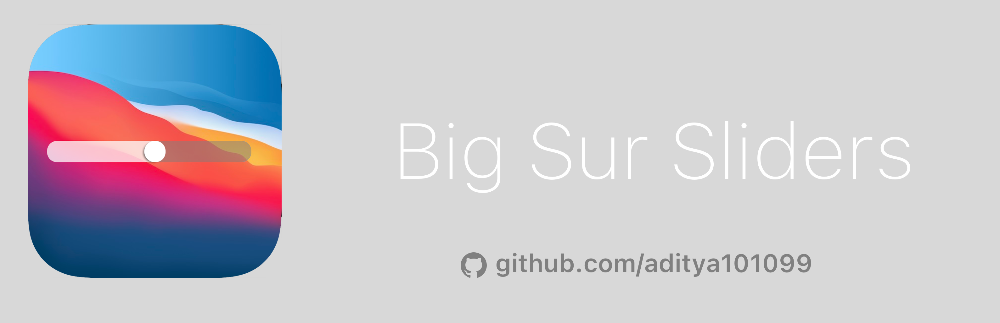
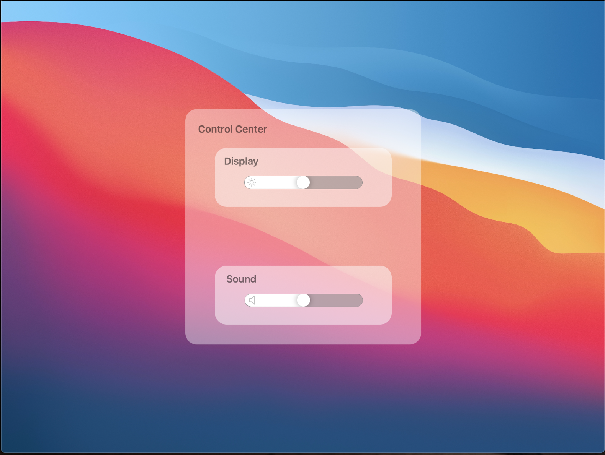

# Big Sur Sliders

Inspired by the sliders in the new Control Center in macOS Big Sur, Big Sur Sliders is an easy way to implement beautiful sliders in your app that reflect the evolving design of macOS.

# Table of Contents
* [Introduction](https://github.com/aditya101099/Big-Sur-Slider#introduction)
* [Usage](https://github.com/aditya101099/Big-Sur-Slider#usage)
* [Technologies](https://github.com/aditya101099/Big-Sur-Slider#technologies)
* [Requirements](https://github.com/aditya101099/Big-Sur-Slider#requirements)
* [Status](https://github.com/aditya101099/Big-Sur-Slider#status)
* [Acknowledgements](https://github.com/aditya101099/Big-Sur-Slider#acknowledgements)

## Introduction

The new sliders in macOS Big Sur's Control Center are gorgeous, and many developers may want to include a similar-looking slider into their apps. Big Sur Sliders allows developers to do just that. It's a SwiftUI view that can directly be embedded into a SwiftUI app. It also features a small glyph that can be customized with any image, or omitted entirely. 

This repository also features a demo app for seeing how it works and testing it out on your own devices.

Big Sur Sliders is written in Swift, and is compatible with any SwiftUI view. You can use this in apps for iOS, iPadOS, and macOS.

## Usage

If you would like to use Big Sur Sliders in your own app, download this repository and look for the **BigSurSliders.swift** file. It contains all the code you'll need to integrate this view into your apps.

If you would like a demo of the slider, open the project in **Xcode** and navigate to the **DemoView.swift** file. Use the Canvas on the right hand side to preview it, or build it to your own device.

Although you can provide your own slider dimensions, it is highly recommended that you use a width of 200px and a height of 22px - some view issues arise when other dimensions are used.

## Technologies

Big Sur Sliders is built in pure, unadulterated SwiftUI.

## Requirements

SwiftUI requires any iOS device iOS 13 or later, or any Mac running macOS Catalina (10.15) or later.

## Status 

The slider is currently functional, although there are some view issues if you deviate from the standard recommended dimensions of a width of 200px and a height of 22px.

## Acknowledgements

Inspired by Apple, and an iOS 11+ style slider found [here](https://stackoverflow.com/questions/58286350/how-to-create-custom-slider-by-using-swiftui)

